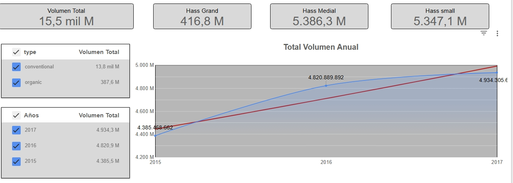

# Análisis de Mercado y Tendencias - Aguacate

**Objetivo:** Analizar las tendencias de volumen, distribución geográfica y comportamiento por tipo de producto en el mercado de aguacate Hass.

**Herramientas utilizadas:**
* **Excel:** Limpieza, normalización y transformación de datos brutos.
* **Looker Studio:** Visualización interactiva de indicadores de mercado.

**Procesos realizados:**
* **Análisis de Volumen:** Seguimiento del volumen total anual y segmentación por tipo (convencional vs. orgánico).
* **Distribución Geográfica:** Identificación de regiones clave mediante mapas de calor (heatmaps).
* **Análisis Comparativo:** Evaluación de volúmenes según el tipo de caja (Small, Large, XLarge).

**Principales Hallazgos (Insights):**
* **Tendencia de Crecimiento:** Visualización de la evolución del volumen a lo largo de los años (2015-2017).
* **Concentración de Mercado:** Identificación de las regiones con mayor volumen de ventas a través de la distribución geográfica.
* **Preferencia de Producto:** Comparativa de volumen total por tipo y tamaño de empaque.

## Visualizaciones del Reporte

Aquí puedes ver los gráficos principales del análisis:

## Dashboard Interactivo
Puedes explorar el informe completo aquí:
[Haz clic aquí para ver el Dashboard](https://datastudio.google.com/reporting/52077fca-7d8e-4843-a489-6f860aa02e18)
